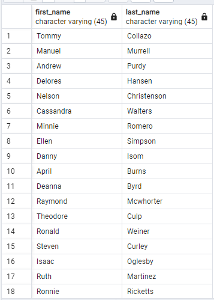

1. SELECT city.city, country.country FROM city
   LEFT JOIN country ON city.country_id = country.country_id;

    

2. SELECT customer.first_name, customer.last_name FROM payment
   RIGHT JOIN customer ON payment.customer_id = customer.customer_id;

    

3. SELECT customer.first_name, customer.last_name FROM customer
   FULL JOIN rental ON customer.customer_id = rental.customer_id;

    